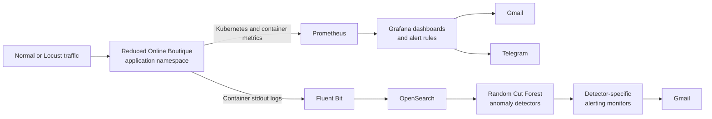

# Security Monitoring for Microservice Environments

Implementation repository for the bachelor thesis:

> **Enhancing Security Monitoring in Microservice Environments Using AI-Driven Operations**

This project deploys a reduced version of Google Online Boutique on Kubernetes and combines infrastructure monitoring, centralized application logging, rule-based alerting, unsupervised anomaly detection, controlled attack simulation, and external notifications.

The technical implementation and formal experiments are complete.

## Project Objectives

The project investigates how two monitoring approaches complement each other in a microservice environment:

- **Metrics-based monitoring:** Prometheus and Grafana detect availability problems and resource pressure through predefined rules.
- **Log-based behavioral detection:** Fluent Bit and OpenSearch analyze application activity using Random Cut Forest anomaly detectors.

Three controlled application-layer scenarios were evaluated:

1. Endpoint scanning
2. HTTP flood
3. Checkout workflow abuse

## Architecture



The runtime is divided into two Kubernetes namespaces:

- `application`: reduced Online Boutique services
- `monitoring`: Prometheus, Grafana, Alertmanager, Fluent Bit, OpenSearch, and OpenSearch Dashboards

## Application Services

The active application contains:

- `frontend`
- `productcatalogservice`
- `cartservice`
- `redis-cart`
- `checkoutservice`
- `paymentservice`
- `shippingservice`
- `currencyservice`
- `emailservice`

The following original demo services are excluded from the deployed thesis environment:

- `adservice`
- `recommendationservice`
- `loadgenerator`

Custom Locust workloads are used instead of the built-in load generator so baseline, attack, and recovery traffic can be controlled explicitly.

## Monitoring Stack

| Component | Purpose |
|---|---|
| Prometheus | Kubernetes and container metric collection |
| Grafana | Dashboards, threshold rules, Gmail alerts, and Telegram alerts |
| Alertmanager | Prometheus alert-management component |
| Fluent Bit | Application container-log collection |
| OpenSearch | Log storage, search, anomaly results, monitors, and notification state |
| OpenSearch Dashboards | Log exploration, anomaly-detector management, and alerting UI |
| Locust | Controlled baseline and attack workloads |

## Detection Layers

### Grafana Rule-Based Alerts

The final rule set includes:

- Application Pod Not Ready
- Application Pod Restart Detected
- Frontend CPU Spike
- Checkout Service CPU Spike
- High CPU Usage by Pod
- High Memory Usage by Pod

The exported rule definitions are stored in:

```text
monitoring/grafana/alert-rules.yaml
```

### OpenSearch Anomaly Detectors

| Detector | ID | Features | Main purpose |
|---|---|---|---|
| `Application_Log_Volume_Anomaly_Detector` | `gBrZ054Bc5K54Bmgc9jj` | `log_count` | Generic application log-volume changes |
| `AD_02R_Frontend_HTTP_Behaviour` | `aTnM9J4B5r61Gbzyp2UM` | `request_count`, `average_latency_ms` | Frontend request-volume and latency behavior |
| `AD_03_Endpoint_Scanning_Behaviour` | `kDgI9J4B5r61GbzyHLG3` | `unique_path_count` | Endpoint enumeration and reconnaissance |
| `AD_04R_Checkout_Workflow_Behaviour` | `WDla9J4B5r61GbzyczN7` | `checkout_count`, `unique_checkout_sessions` | Abnormal use of the checkout workflow |

The detector export is stored in:

```text
monitoring/opensearch/all-detectors-final.json
```

## Formal Experiment Results

Each formal scenario used three valid runs and followed a measured structure:

```text
Normal baseline → Attack → Recovery
```

| Scenario | Primary detection result | Grafana resource alerts | Availability impact |
|---|---:|---:|---:|
| Endpoint scanning | AD-03: 3/3 | 0/3 | None |
| HTTP flood | AD-01: 2/3; AD-02R: 0/3 | CPU and memory alerts: 3/3 | None |
| Checkout abuse | AD-04R: 3/3 | 0/3 | None |

### Endpoint Scanning

- 3,345 total requests
- 0 failures
- AD-03 detection rate: 100%
- Average confidence: approximately 0.9931
- Average detection latency: approximately 89.4 seconds
- No Grafana resource alert

### HTTP Flood

- 17,790 total requests
- 0 failures
- Average traffic rate: approximately 19.89 requests/s
- AD-01 detection rate: 66.7%
- AD-02R formal detection rate: 0%
- Grafana CPU and memory alerts fired in all three runs
- No service unavailability

### Checkout Workflow Abuse

- 1,123 successful attack-phase checkouts
- 0 failures
- Average increase over baseline: 47.74×
- AD-04R detection rate: 100%
- Average confidence: 0.996897
- Average detection latency: 112.918 seconds
- No Grafana alert and no service unavailability

The results show that resource rules and application-behavior detectors provide different forms of visibility. No single rule or detector covered every scenario.

## Notification Paths

Two notification paths were validated.

### Grafana

```text
Prometheus metrics
→ Grafana rule
→ Grafana contact point
→ Gmail and Telegram
```

Validated examples include:

- Frontend CPU Spike
- High CPU Usage by Pod

### OpenSearch

```text
Application logs
→ OpenSearch detector
→ Detector-specific monitor
→ Trigger and action
→ Gmail
```

The enabled monitor set is:

- `MON-AD01-Application-Log-Volume`
- `MON-AD02R-Frontend-HTTP-Behaviour`
- `MON-AD03-Endpoint-Scanning`
- `MON-AD04R-Checkout-Workflow`

A final three-minute validation sequence produced detector-generated Gmail notifications for all four monitors. The OpenSearch alert table reported no monitor errors.

## Repository Structure

```text
.
├── application/
│   └── manifests/                 Kubernetes application manifests
├── docs/
│   ├── notes/                     Working technical notes
│   └── progress/                  Dated project progress reports
├── evidence/
│   ├── 00-system-state-20260617-0859/
│   ├── 01-baseline/
│   ├── 01-opensearch-persistence-test/
│   ├── 02-formal-baseline/
│   ├── 03-endpoint-scanning/
│   ├── 04-http-flood/
│   ├── 05-checkout-abuse/
│   ├── 06-notification-path/
│   └── configuration-backups/
├── experiments/
│   ├── attacks/                   Endpoint scan, HTTP flood, checkout abuse
│   ├── baseline/                  General and checkout baseline workloads
│   └── run-checkout-formal.ps1    Checkout experiment orchestrator
├── monitoring/
│   ├── fluent-bit/
│   ├── grafana/
│   ├── opensearch/
│   └── prometheus-grafana/
├── scripts/
│   └── start-system.ps1           Local port-forward launcher
├── src/                           Application service source code
├── docker-compose.yml             Application-only local deployment
└── README.md
```

## Prerequisites

The project was developed as a local controlled laboratory environment.

Recommended tools:

- Docker and Docker Compose
- A local Kubernetes cluster
- `kubectl`
- Helm
- PowerShell
- Python 3
- Locust

The Kubernetes cluster must be able to access the locally built application images. The provided Grafana PVC uses the `hostpath` storage class and may need adjustment on another cluster.

## Application Deployment

### Docker Compose

Docker Compose provides the fastest application-only validation path.

```bash
docker compose build
docker compose up -d
docker compose ps
```

Open the frontend at:

```text
http://localhost:8080
```

Stop the application with:

```bash
docker compose down
```

### Kubernetes

Create the namespaces:

```bash
kubectl apply -f application/manifests/namespaces.yaml
```

Deploy the reduced application:

```bash
kubectl apply -f application/manifests/application-reduced.yaml
```

Check the application:

```bash
kubectl get pods -n application
kubectl get svc -n application
```

Before deployment, ensure the images referenced by the manifest are available to the Kubernetes runtime.

## Monitoring Deployment

Add the required Helm repositories:

```bash
helm repo add prometheus-community https://prometheus-community.github.io/helm-charts
helm repo add opensearch https://opensearch-project.github.io/helm-charts/
helm repo add fluent https://fluent.github.io/helm-charts
helm repo update
```

Create the Grafana PVC before installing or upgrading the monitoring release:

```bash
kubectl apply -f monitoring/prometheus-grafana/grafana-pvc.yaml
```

Install the Prometheus and Grafana stack:

```bash
helm upgrade --install monitoring prometheus-community/kube-prometheus-stack   --namespace monitoring   --create-namespace   --values monitoring/prometheus-grafana/values.yaml
```

Install OpenSearch:

```bash
helm upgrade --install opensearch opensearch/opensearch   --namespace monitoring   --values monitoring/opensearch/values.yaml
```

Install OpenSearch Dashboards:

```bash
helm upgrade --install opensearch-dashboards opensearch/opensearch-dashboards   --namespace monitoring   --values monitoring/opensearch/opensearch-dashboards-values.yaml
```

Install Fluent Bit:

```bash
helm upgrade --install fluent-bit fluent/fluent-bit   --namespace monitoring   --values monitoring/fluent-bit/values.yaml
```

Check the stack:

```bash
kubectl get pods -n monitoring
kubectl get svc -n monitoring
helm list -n monitoring
```

## Notification Secrets

SMTP and bot credentials must be created locally as Kubernetes Secrets.

The deployment expects:

```text
grafana-smtp-credentials
opensearch-notification-credentials
```

Do not commit real passwords, application passwords, bot tokens, recipient addresses, or generated Secret manifests.

Notification contact points, policies, OpenSearch destinations, and monitor actions may also exist as persisted runtime configuration. Evidence and backups are stored under:

```text
evidence/06-notification-path/
evidence/configuration-backups/
```

## Accessing the System

On Windows PowerShell, the provided script opens the required port forwards:

```powershell
.\scripts\start-system.ps1
```

The script exposes:

| Interface | Local URL |
|---|---|
| Frontend | `http://localhost:8080` |
| Grafana | `http://localhost:3000` |
| Prometheus | `http://localhost:9090` |
| OpenSearch Dashboards | `http://localhost:5601` |
| OpenSearch API | `http://localhost:9200` |
| Alertmanager | `http://localhost:9093` |

Keep the PowerShell window open while using the forwarded services. Press `Ctrl+C` to stop them.

## Running the Attack Workloads

Activate the Python environment and confirm Locust is installed.

Example three-minute endpoint scan:

```powershell
python -m locust `
  --locustfile .\experimentsttacks\endpoint-scan-locustfile.py `
  --headless `
  --users 2 `
  --spawn-rate 2 `
  --run-time 3m `
  --host http://localhost:8080
```

Example three-minute checkout-abuse run:

```powershell
python -m locust `
  --locustfile .\experimentsttacks\checkout-abuse-locustfile.py `
  --headless `
  --users 5 `
  --spawn-rate 1 `
  --run-time 3m `
  --host http://localhost:8080
```

Example three-minute HTTP flood:

```powershell
python -m locust `
  --locustfile .\experimentsttacks\http-flood-locustfile.py `
  --headless `
  --users 20 `
  --spawn-rate 5 `
  --run-time 3m `
  --host http://localhost:8080
```

These scripts are restricted to the local thesis environment. Do not point them at systems that you do not own or have explicit permission to test.

## Evidence and Documentation

The formal scenario summaries are stored under:

```text
evidence/03-endpoint-scanning/
evidence/04-http-flood/
evidence/05-checkout-abuse/
```

Notification-path evidence is stored under:

```text
evidence/06-notification-path/
```

The main implementation and experiment progress report is:

```text
docs/progress/2026-06-26-anomaly-detection-and-scenario-validation.md
```

The final technical-completion note is:

```text
docs/progress/2026-06-29-notification-path-and-project-completion.md
```

## Important Interpretation Notes

- The formal experiment results and the later notification-validation runs serve different purposes.
- AD-02R missed all three formal HTTP-flood runs even though it produced a later positive anomaly during notification validation.
- Detector misses were retained as valid results and were not rerun until a favorable outcome appeared.
- OpenSearch Random Cut Forest is an online adaptive model; repeated traffic patterns can change later anomaly scores.
- Grafana thresholds were fixed before the formal experiments and were not lowered to force alerts.
- The environment is local and single-node, so the results are controlled experimental findings rather than production-scale benchmarks.

## Security Notice

This repository represents a local thesis laboratory, not a production-ready security platform.

Notable limitations include:

- OpenSearch security is disabled in the local deployment.
- The cluster is single-node.
- Local port forwarding is used for access.
- Notification credentials are externally supplied.
- The provided alert thresholds are specific to the local environment.
- Storage-class names may need adjustment on another Kubernetes cluster.

Before sharing or deploying the repository elsewhere:

- Remove or rotate any exposed credentials.
- Replace default administrator passwords.
- Review backups for sensitive runtime data.
- Enable authentication and TLS.
- Review notification recipients and bot tokens.
- Reconfigure storage and resource limits.

## Main Finding

> Metrics-based monitoring is effective for visible infrastructure pressure, while log-based anomaly detection can identify application behavior that does not exceed CPU, memory, restart, or readiness thresholds.

Combining Prometheus, Grafana, Fluent Bit, OpenSearch, scenario-specific anomaly features, and external notification channels provided broader monitoring coverage than either metrics or logs alone.

## Project Status

```text
Application and Kubernetes deployment        Complete
Prometheus and Grafana monitoring             Complete
Fluent Bit and OpenSearch pipeline            Complete
Four anomaly detectors                       Complete
Three formal attack scenarios                Complete
Grafana Gmail and Telegram alerts             Complete
OpenSearch detector-to-Gmail alerts           Complete
Persistence and evidence collection           Complete
Technical implementation                      Complete
Thesis report                                 In progress
```

## Acknowledgement

The application is based on Google Online Boutique and was reduced and adapted for controlled bachelor-thesis security-monitoring experiments.
